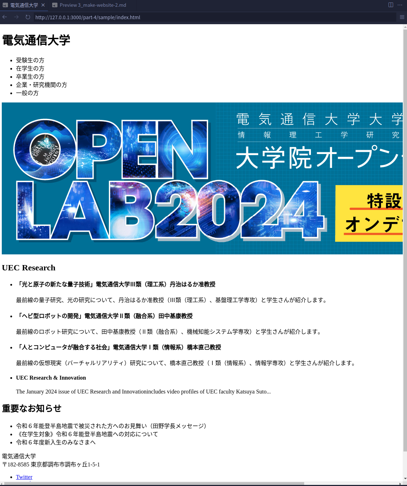

# 実際に WEB サイトを作ろう（2/3）

それでは、作っていきましょう。

## HTML を書く

といっても今回は CSS について深めたいので、`practice/template.html`に雛形は用意しておきました。

そのまま使ってもらって大丈夫ですが、もし自分で全部書きたいぜっ！って人がいれば、自分でゴリゴリ書いてください！
少なからず実力はつくと思います。（大変ですが）

<details>
  <summary>
  template.html
  </summary>

```html
<!DOCTYPE html>
<html lang="ja">
  <head>
    <meta charset="UTF-8" />
    <meta name="viewport" content="width=device-width, initial-scale=1.0" />
    <title>電気通信大学</title>
  </head>
  <body>
    <header>
      <div>
        <h1>電気通信大学</h1>
        <nav>
          <ul>
            <li>受験生の方</li>
            <li>在学生の方</li>
            <li>卒業生の方</li>
            <li>企業・研究機関の方</li>
            <li>一般の方</li>
          </ul>
        </nav>
      </div>
      
    </header>
    <main>
      <section id="uec-research">
        <h2>UEC Research</h2>
        <ul>
          <li>
            <h4>
              「光と原子の新たな量子技術」電気通信大学Ⅲ類（理工系）丹治はるか准教授
            </h4>
            <p>
              最前線の量子研究、光の研究について、丹治はるか准教授（Ⅲ類（理工系）、基盤理工学専攻）と学生さんが紹介します。
            </p>
          </li>
          <li>
            <h4>
              「ヘビ型ロボットの開発」電気通信大学Ⅱ類（融合系）田中基康教授
            </h4>
            <p>
              最前線のロボット研究について、田中基康教授（Ⅱ類（融合系）、機械知能システム学専攻）と学生さんが紹介します。
            </p>
          </li>
          <li>
            <h4>
              「人とコンピュータが融合する社会」電気通信大学Ⅰ類（情報系）橋本直己教授
            </h4>
            <p>
              最前線の仮想現実（バーチャルリアリティ）研究について、橋本直己教授（Ⅰ類（情報系）、情報学専攻）と学生さんが紹介します。
            </p>
          </li>
          <li>
            <h4>UEC Research & Innovation</h4>
            <p>
              The January 2024 issue of UEC Research and Innovationincludes
              video profiles of UEC faculty Katsuya Suto...
            </p>
          </li>
        </ul>
      </section>
      <section id="news">
        <h2>重要なお知らせ</h2>
        <ul>
          <li>
            令和６年能登半島地震で被災された方へのお見舞い（田野学長メッセージ）
          </li>
          <li>《在学生対象》令和６年能登半島地震への対応について</li>
          <li>令和６年度新入生のみなさまへ</li>
        </ul>
      </section>
    </main>
    <footer>
      <div>
        <div>
          <div>電気通信大学</div>
          <div>〒182-8585 東京都調布市調布ヶ丘1-5-1</div>
        </div>

        <ul>
          <li>
            <a href="https://twitter.com/uec_twitter">Twitter</a>
          </li>
          <li>
            <a href="https://youtube.com/uec_youtube">Youtube</a>
          </li>
          <li>
            <a href="https://instagram.com/uec_instagram">Instagram</a>
          </li>
        </ul>
      </div>
      <div>Copyright © UEC Tokyo. All rights reserved.</div>
    </footer>
  </body>
</html>
```

</details>
<br>
見慣れないタグがいくつかあるので、紹介します。

- `header` : 文書やセクションのヘッダー部分。通常は見出しやナビゲーションが含まれる。
- `main` : 文書の主要なコンテンツ部分。1 ページに 1 つのみ使用。
- `section` : 文書内の主題ごとのセクション。独立した主題を持つコンテンツを含む。
- `footer` : 文書やセクションのフッター部分。通常は著作権情報や関連リンクが含まれる。

これらのタグを使うことで、直接的な（見た目等の）影響はありませんが、HTML 文書の構造がよりわかりやすいものとなります。

---

さて、何もスタイルをあてていない状態だと、このようになっていると思います。



これから、この HTML に、様々なスタイルを指定して、前節で見せた完成形まで持っていきましょう。

## スタイルシートを読み込む

スタイルシートが大きくなってしまうので、前回の講習で説明したように、スタイルシートを別ファイルに切り分け、HTML で読み込むようにしましょう。

HTML ファイルと同じ階層に`style.css`を作成し

```html
<link rel="stylesheet" href="./style.css" />
```

を HTML の`head`タグ内に記述し、CSS ファイルを読み込みます。

ついでに、`style.css`の先頭に、

```css
@charset "UTF-8";
```

も追加しておきます。

## 最初に...こまごまとした設定

```css
* {
  box-sizing: border-box;
}
```

を設定するとこで、すべての要素について、要素内部の余白（後述する`padding`）や枠線（`border`）を加味して要素の幅・高さを計算するようにできます。（難しいので、意味はわからなくて大丈夫ですが）基本的に`border-box`に設定しておくと困らないと思います。

ちなみに、`*`はすべてのセレクタを表します。

また、

```css
body {
  font-family: sans-serif;
  margin: 0;
  padding: 0;
}
```

を追加することで、フォントをゴシック（Sans-Serif）に設定し、ブラウザがデフォルトでつけてしまうページの一番外枠の余白を削除しています。

## `header`のスタイル

```html
<header>
  <div class="header-nav">
    <h1 class="header-logo">電気通信大学</h1>
    <nav>
      <ul class="header-menu">
        <li>受験生の方</li>
        <li>在学生の方</li>
        <li>卒業生の方</li>
        <li>企業・研究機関の方</li>
        <li>一般の方</li>
      </ul>
    </nav>
  </div>
</header>
```

---

Flexbox をつかって、ヘッダー（ナビゲーションバー）の中身を横並びに。

`justify-content: space-between;`でヘッダーアイコン（今回は文字）とメニューを左右に分ける。
`align-items: center;`で上下中央揃え。

高さを`5rem`、内側の余白を左右`1rem`に設定。

背景色を青（#17288b）、文字色を白（#ffffff）

```css
.header-nav {
  display: flex;
  justify-content: space-between;
  align-items: center;

  height: 5rem;

  padding: 0 1rem;

  background-color: #17288b;
  color: #ffffff;
}
```

---

ヘッダーのメニューも横並びにする。

また、そのままだとリストの先頭の丸印が表示されるので、`list-style-type: none;`で非表示にする。

```css
.header-menu {
  display: flex;

  list-style-type: none;
}
```

---

メニューそれぞれの左右の外側の余白を`1rem`に設定。

```css
.header-menu li {
  margin: 0 1rem;
}
```

## `footer`のスタイル

```html
<footer>
  <div class="footer-nav">
    <div>
      <div class="footer-logo">電気通信大学</div>
      <div>〒182-8585 東京都調布市調布ヶ丘1-5-1</div>
    </div>

    <ul class="sns-list">
      <li>
        <a href="https://twitter.com/uec_twitter">Twitter</a>
      </li>
      <li>
        <a href="https://youtube.com/uec_youtube">Youtube</a>
      </li>
      <li>
        <a href="https://instagram.com/uec_instagram">Instagram</a>
      </li>
    </ul>
  </div>
  <div class="copy-right">Copyright © UEC Tokyo. All rights reserved.</div>
</footer>
```

```css
footer {
  background-color: #17288b;

  color: #fff;
}
```

---

ヘッダーナビゲーションと同様に設定する。

```css
.footer-nav {
  display: flex;
  align-items: center;
  justify-content: space-between;

  padding: 1rem;
}
```

---

フォントサイズを大きくし（`2rem`）、太字にする。

```css
.footer-nav .footer-logo {
  font-size: 2rem;
  font-weight: bold;
}
```

---

SNS のリストも横並びにしたいので、ヘッダーメニューと同じような設定にする。

```css
.sns-list {
  display: flex;
  justify-content: center;
  align-items: center;

  list-style-type: none;
}
```

---

リストアイテムの外側の余白を左右`1rem`に設定。

```css
.sns-list li {
  margin: 0 1rem;
}
```

---

ハイパーリンクのスタイルを変更。

```css
.sns-list li a {
  color: #fff;

  text-decoration: none;
  font-weight: bold;
}
```

---

一番下に表示されるコピーライトを中央揃えで表示。
上下の余白をつける（`1rem`）。

```css
.copy-right {
  text-align: center;
  padding: 1rem 0;
}
```
